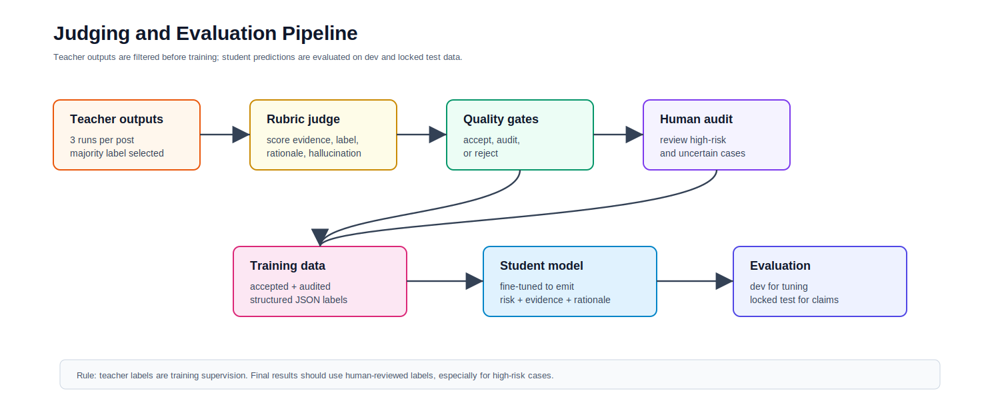
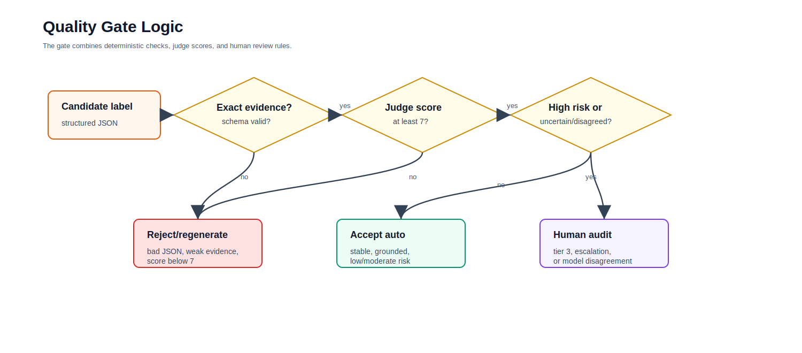

# Judging and Evaluation Pipeline

## Purpose

The auxiliary-label generation pipeline creates structured labels with a teacher LLM. The judging and evaluation pipeline decides which labels are safe enough to train on, which labels need human review, and how to evaluate the final student model.

This stage protects the project from three common failures:

- using hallucinated teacher rationales as training data
- training on high-risk examples that were never reviewed
- reporting inflated results from teacher-labeled test data

## Figure 1. Judging and Evaluation Overview



## Inputs

The judging stage starts after primary teacher generation.

Expected input file:

```text
data/synthetic_aux/raw_primary_runs.jsonl
```

Each record should include:

- `id`
- `text`
- `gold_label`
- `runs`
- `majority_label`
- `majority_meta`

The `majority_label` is the candidate structured auxiliary label selected from the 3 teacher runs.

## Stage 1. Judge Candidate Labels

Run the rubric judge:

```powershell
python src/teacher_labeling/judge_aux_labels.py `
  --input data/synthetic_aux/raw_primary_runs.jsonl `
  --output data/synthetic_aux/judged_candidates.jsonl `
  --model "anthropic/claude-sonnet-4" `
  --base-url "https://openrouter.ai/api/v1" `
  --api-key-env OPENROUTER_API_KEY
```

The judge checks:

- schema validity
- whether evidence spans are exact
- whether the risk tier is supported
- whether the rationale is grounded
- hallucination risk
- whether human audit is needed

Judge output fields:

```json
{
  "schema_valid": true,
  "evidence_exact": true,
  "label_supported": true,
  "rationale_supported": true,
  "hallucination_risk": "low",
  "disagreement_risk_tier": 2,
  "score": 9,
  "reasons": ["Evidence spans are exact and support the tier."],
  "requires_human_audit": false
}
```

## Stage 2. Apply Deterministic Quality Gates

The judge is useful, but it should not be the only filter. Apply deterministic gates:

```powershell
python src/teacher_labeling/apply_quality_gates.py `
  --input data/synthetic_aux/judged_candidates.jsonl `
  --output-dir data/synthetic_aux/gated `
  --min-score 7 `
  --audit-score 8
```

This creates:

```text
data/synthetic_aux/gated/
  accepted_auto.jsonl
  human_audit_queue.jsonl
  rejected.jsonl
  quality_gate_summary.json
```

## Figure 2. Quality Gate Logic



## Gate Decisions

### Accept Automatically

Accept a label automatically only if:

- risk tier is valid
- evidence spans are non-empty
- evidence spans are exact substrings of the input text
- judge score is at least 8
- label is supported
- hallucination risk is not high
- teacher runs are stable
- example is not high/imminent risk
- escalation is not required

### Send to Human Audit

Send to human audit if:

- risk tier is 3
- escalation is required
- judge score is 7
- judge requests human audit
- teacher runs disagree
- judge tier differs by more than 1 level
- text contains sarcasm, metaphor, cultural idiom, or ambiguous intent

### Reject

Reject or regenerate if:

- JSON is invalid
- `risk_tier` is missing or outside 0-3
- evidence spans are empty
- evidence spans are not exact text from the post
- judge score is below 7
- hallucination risk is high
- label is not supported by evidence

## Stage 3. Human Audit Queue

Export audit cases to CSV:

```powershell
python src/teacher_labeling/export_human_audit_sheet.py `
  --input data/synthetic_aux/gated/human_audit_queue.jsonl `
  --output data/synthetic_aux/gated/human_audit_sheet.csv `
  --max-text-chars 2000
```

Human reviewers fill:

- `human_decision`
- `corrected_risk_tier`
- `corrected_evidence_spans`
- `corrected_notes`

Recommended human decisions:

| Decision | Meaning |
|---|---|
| accept | teacher label is acceptable |
| correct | use human-corrected tier/evidence |
| reject | do not use for training |
| uncertain | send to lead adjudication |

All tier-3/high-imminent examples should be reviewed before being used for training.

## Stage 4. Build Training Data

Use only:

- automatically accepted examples
- human-audited accepted examples
- human-corrected examples after adjudication

Do not use:

- rejected examples
- unaudited high-risk examples
- test-set examples

The training file should be:

```text
student_sft_train.jsonl
```

The student should learn to emit the full structured JSON.

## Stage 5. Evaluate Student Predictions

After training, run the student model on dev or test examples and save predictions as JSONL.

Recommended prediction format:

```json
{
  "id": "example-001",
  "text": "...",
  "reference": {
    "risk_tier": 2,
    "evidence_spans": ["exact phrase"],
    "risk_factors": ["active ideation"],
    "protective_factors": [],
    "clinical_rationale": "...",
    "plain_language_summary": "...",
    "recommended_next_step": "Urgent support",
    "escalation_required": true,
    "confidence": 0.82,
    "uncertainty_flags": []
  },
  "prediction": {
    "risk_tier": 2,
    "evidence_spans": ["exact phrase"],
    "risk_factors": ["active ideation"],
    "protective_factors": [],
    "clinical_rationale": "...",
    "plain_language_summary": "...",
    "recommended_next_step": "Urgent support",
    "escalation_required": true,
    "confidence": 0.76,
    "uncertainty_flags": []
  }
}
```

Run evaluation:

```powershell
python src/evaluation/evaluate_triage_predictions.py `
  --input data/eval/student_predictions.jsonl `
  --output-json data/eval/metrics.json `
  --output-errors data/eval/error_log.csv `
  --reference-field reference `
  --prediction-field prediction
```

## Figure 3. Evaluation Metrics


## Core Metrics

### Classification Metrics

- accuracy
- macro-F1
- weighted-F1
- per-tier precision
- per-tier recall
- confusion matrix
- quadratic weighted kappa

### Safety Metrics

- tier-3 recall
- tier-2-or-higher recall
- under-triage count
- under-triage rate
- severe under-triage count
- mean severity error

Under-triage is the most important safety metric:

```text
true tier >= 2 but predicted tier <= 1
```

Severe under-triage:

```text
true tier = 3 but predicted tier <= 1
```

### Rationale/Evidence Metrics

- evidence-span exact-set precision
- evidence-span exact-set recall
- evidence-span exact-set F1
- unsupported-claim rate from judge or human review
- label-rationale consistency

The included deterministic evaluator computes exact-set evidence F1. For deeper rationale evaluation, run the rubric judge on student outputs as well.

## Dev vs Test Use

### Dev Set

Use dev to:

- pick the best checkpoint
- tune thresholds
- tune teacher filters
- compare S1/S2/S3 variants
- debug failure modes

Dev can use teacher-generated auxiliary labels, but a small human-reviewed dev subset is better.

### Locked Test Set

Use test only once for final claims.

The locked test set should be human-reviewed. Do not evaluate final claims against teacher-generated labels alone.

## Recommended Acceptance Policy

For training:

- accept auto-passed tier 0-2 examples
- audit all tier-3 examples
- audit all escalation-required examples
- reject judge score below 7
- audit judge score 7
- accept judge score 8-10 if all deterministic checks pass

For reporting:

- report test metrics only on human-reviewed labels
- include every high-risk miss in the error table
- include examples of unsupported rationale failures
- state clearly that teacher labels are noisy synthetic supervision

## File Checklist

Expected files after judging:

```text
data/synthetic_aux/
  raw_primary_runs.jsonl
  judged_candidates.jsonl
  gated/
    accepted_auto.jsonl
    human_audit_queue.jsonl
    human_audit_sheet.csv
    rejected.jsonl
    quality_gate_summary.json
```

Expected files after evaluation:

```text
data/eval/
  student_predictions.jsonl
  metrics.json
  error_log.csv
```
