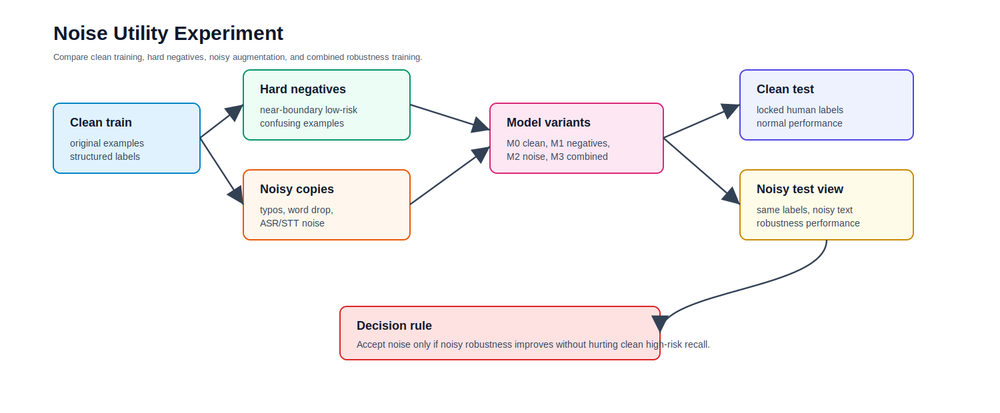
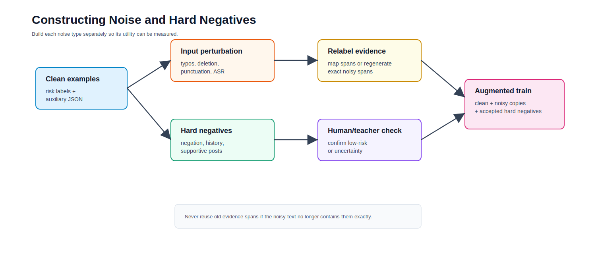
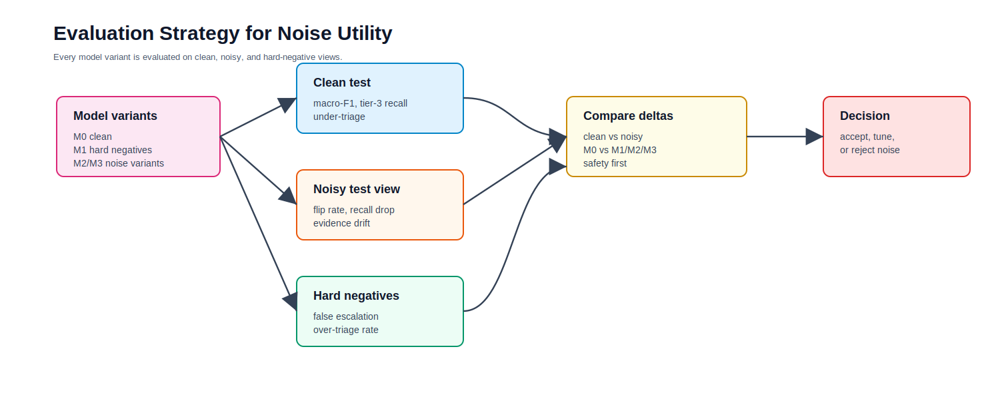

# Noise and Hard-Negative Robustness Experiment Design

## 1. Purpose

This experiment tests whether adding noisy examples or hard-negative examples improves a small triage model.

The goal is not simply to improve average accuracy. The goal is to answer:

1. Does noise-augmented training make the model more robust to noisy inputs?
2. Do hard negatives reduce false high-risk predictions?
3. Does either strategy hurt clean high-risk recall?
4. Does the model remain evidence-grounded under noisy inputs?

For crisis triage, a noise strategy is useful only if it improves robustness without increasing dangerous under-triage.

## 2. Key Definitions

### Clean Example

A normal training or test example with a trusted risk label and structured auxiliary labels.

Example:

```text
I have pills and I am thinking of taking them tonight.
```

### Input Noise

A label-preserving corruption of the input text.

The risk label should stay the same, but the wording becomes messier.

Example:

```text
i hav pills and thinking taking them tonite
```

### Hard Negative

An example that looks emotionally or clinically concerning but should not be classified as high/imminent risk.

Example:

```text
I felt suicidal years ago, but I am safe now and helping someone else through it.
```

### Label Noise

Incorrect labels. This is different from input noise.

Label noise is risky in this project and should be used only as a diagnostic stress test, not as the main method.

## 3. Experimental Hypotheses

| Hypothesis | Expected outcome |
|---|---|
| H1: Input-noise augmentation improves robustness | Lower triage flip rate and better recall on noisy test inputs |
| H2: Hard negatives reduce over-triage | Fewer low-risk examples incorrectly predicted as tier 2 or 3 |
| H3: Too much noise hurts clean performance | Clean macro-F1 or tier-3 recall drops when noise ratio is too high |
| H4: Noise may hurt evidence grounding | Evidence spans may drift under corrupted input |
| H5: Label noise is harmful | Incorrect labels increase under-triage and reduce calibration |

## 4. Figure 1. Overall Experiment Design



## 5. Dataset Views

Create five views of the data.

| Dataset view | Description | Used for |
|---|---|---|
| Clean train | Original train examples with auxiliary labels | Baseline training |
| Hard-negative train | Low-risk but confusing examples | Reduce false high-risk alarms |
| Noisy train | Corrupted copies of clean train examples | Improve robustness |
| Clean locked test | Human-reviewed final test inputs | Final clean performance |
| Noisy locked test view | Noisy copies of locked test inputs with same gold labels | Robustness evaluation |

Important rule:

```text
Never change the locked test labels.
Create noisy copies of the test inputs, but keep the original human-reviewed labels.
```

## 6. Noise Types

Use controlled, named noise types so results are interpretable.

| Noise type | Example | Why it matters |
|---|---|---|
| Typo noise | tonight -> tonite | Informal online writing |
| Character deletion | suicide -> suicde | Misspellings and typing errors |
| Punctuation removal | "I can't." -> "i cant" | Social-media style |
| Word deletion | drop 5-15% of words | Incomplete inputs |
| ASR/STT noise | text -> TTS -> Whisper transcript | Speech pipeline robustness |
| Distractor addition | adds unrelated emotional context | Tests evidence focus |
| Negation trap | "I do not want to die" | Prevents false positives |
| Historical mention | "I attempted years ago" | Distinguishes past from current risk |
| Metaphor/idiom | "I'm dead inside" | Avoids literal over-triage |

## 7. Hard-Negative Categories

Hard negatives should be close to the decision boundary.

| Category | Example | Expected tier |
|---|---|---:|
| Depression without self-harm intent | "I feel empty but I am not thinking of hurting myself." | 0-1 |
| Stress without crisis | "I am overwhelmed by exams and need sleep." | 0 |
| Supportive suicide discussion | "Please do not hurt yourself. Call someone now." | 0 or human review depending perspective |
| Historical attempt, currently safe | "I tried years ago, but I am safe now." | 1-2 depending context |
| Negated intent | "I do not want to die." | 0-1 |
| Academic/news mention | "This article discusses suicide prevention." | 0 |
| Metaphor | "This assignment is killing me." | 0 |
| Ambiguous sarcasm | "Guess I'll just disappear lol." | human review / uncertain |

Useful sources:

- C-SSRS `Supportive` examples
- eRisk26 Task 2 control and depression-positive examples
- Dreaddit stress examples, if available
- manually written counterfactuals
- teacher-generated hard negatives with human review

## 8. Figure 2. Noise and Hard-Negative Construction



## 9. Experiment Matrix

Run a small, controlled ablation.

| ID | Training data | Question answered |
|---|---|---|
| M0 | Clean train only | Baseline |
| M1 | Clean train + hard negatives | Do hard negatives reduce over-triage? |
| M2 | Clean train + noisy copies | Does noise training improve noisy-input robustness? |
| M3 | Clean train + hard negatives + noisy copies | Best combined robustness strategy |
| M4 | Clean train + label noise diagnostic | How sensitive is the model to wrong labels? |
| M5 | Clean train, inference-time denoising only | Can preprocessing help without retraining? |

For a short sprint, prioritize:

```text
M0, M1, M2, M3
```

Treat M4 as optional and diagnostic only.

## 10. Noise Ratios

Start small. Too much noise can damage clean performance.

Recommended ratios:

| Condition | Ratio |
|---|---|
| Hard negatives | 25% of clean train size |
| Noisy train copies | 1 noisy copy per clean example |
| STT/noisy speech copies | 30-80 examples for stress testing |
| Label noise diagnostic | 5%, 10%, 20% corrupted labels |

If time is tight:

```text
hard negatives = 25%
input noise = 1 noisy copy per clean example
label noise diagnostic = skip
```

## 11. Train-Time vs Test-Time Questions

Separate the two questions.

### Train-Time Noise

Question:

```text
Does adding noisy examples during training improve the model?
```

Compare:

```text
M0 clean-only model
M2 clean + noisy model
```

### Test-Time Noise

Question:

```text
Does the trained model survive noisy real-world inputs?
```

Evaluate every model on:

```text
clean test
noisy test view
hard-negative test
```

### Inference-Time Denoising

Question:

```text
Can we clean the input before inference instead of retraining?
```

Compare:

```text
M0 on noisy test
M5 denoise -> M0 on noisy test
```

## 12. Evaluation Sets

Create three evaluation sets.

| Evaluation set | Purpose |
|---|---|
| Clean dev/test | Measures normal performance |
| Noisy dev/test view | Measures robustness under corrupted input |
| Hard-negative test | Measures false escalation and over-triage |

For final claims:

- use the locked human-reviewed clean test
- use noisy copies of the same locked test inputs
- keep labels unchanged
- report clean and noisy results separately

## 13. Metrics

### Classification Metrics

- macro-F1
- weighted-F1
- per-tier recall
- quadratic weighted kappa
- confusion matrix

### Safety Metrics

- tier-3 recall
- under-triage count
- severe under-triage count
- over-triage count
- false high-risk rate on hard negatives

### Robustness Metrics

- triage flip rate
- high-risk recall drop
- severity-distance change
- prediction consistency between clean and noisy views

### Evidence Metrics

- evidence span F1
- evidence drift rate
- unsupported-claim rate

## 14. Figure 3. Evaluation Strategy



## 15. Core Robustness Metrics

### Triage Flip Rate

How often the model changes its risk tier after noise is added.

```text
triage_flip_rate = count(pred_clean != pred_noisy) / total_examples
```

Lower is better, but only if the clean prediction is correct.

### High-Risk Recall Drop

How much tier-3 recall decreases under noisy input.

```text
high_risk_recall_drop = tier3_recall_clean - tier3_recall_noisy
```

For this project, this should be close to zero.

### Hard-Negative False Escalation Rate

How often hard negatives are incorrectly escalated.

```text
false_escalation_rate = count(pred_tier >= 2 on hard negatives) / hard_negative_count
```

Lower is better.

### Evidence Drift

How much predicted evidence changes under noisy input.

```text
evidence_drift = 1 - overlap(evidence_clean, evidence_noisy)
```

High drift means the model is not grounding consistently.

## 16. Utility Decision Rule

A noise strategy is useful only if:

```text
noisy high-risk recall improves
AND noisy triage flip rate decreases
AND clean tier-3 recall does not drop by more than 1-2 percentage points
AND hard-negative false escalation decreases
AND unsupported-claim rate does not increase
```

Reject the strategy if:

```text
clean tier-3 recall drops meaningfully
OR under-triage increases
OR evidence grounding gets worse
```

## 17. Recommended Implementation Plan

### Step 1. Build Hard Negatives

Collect:

- C-SSRS Supportive examples
- eRisk26 Task 2 control/depression examples
- manually written negation/historical/metaphor examples

Then ask the teacher to assign structured labels, but require human review for confusing examples.

### Step 2. Generate Noisy Copies

For each clean train example:

- create one typo/punctuation/word-drop noisy copy
- keep the same gold label
- regenerate evidence spans if exact spans no longer match

Important:

If evidence spans changed due to noise, do not reuse old spans blindly. Either map them to the noisy text or ask the teacher to regenerate evidence spans.

### Step 3. Train Model Variants

Train:

```text
M0 clean only
M1 clean + hard negatives
M2 clean + noisy copies
M3 clean + hard negatives + noisy copies
```

Use the same base model, same training budget, and same hyperparameters where possible.

### Step 4. Evaluate

Evaluate each model on:

```text
clean dev/test
noisy dev/test view
hard-negative test
```

### Step 5. Error Analysis

Manually inspect:

- every tier-3 miss
- every severe under-triage
- hard negatives predicted tier 3
- noisy examples whose tier flipped
- examples with evidence drift

## 18. Expected Outcomes

Possible outcomes:

| Outcome | Interpretation |
|---|---|
| M2 improves noisy test but hurts clean test | Too much noise or poor noise type |
| M1 reduces false escalation but hurts recall | Hard negatives are too strong or mislabeled |
| M3 improves noisy and hard-negative results | Best robustness strategy |
| M4 hurts everything | Confirms label noise is harmful |
| M5 helps noisy test without retraining | Simple denoising may be useful |

## 19. Final Recommendation

For the project sprint, run:

```text
M0: clean train only
M1: clean + 25% hard negatives
M2: clean + one noisy copy per clean example
M3: clean + hard negatives + noisy copies
```

Evaluate on:

```text
clean locked test
noisy locked test view
hard-negative test
```

Report:

- clean macro-F1
- noisy macro-F1
- tier-3 recall clean vs noisy
- under-triage count
- hard-negative false escalation
- triage flip rate
- evidence drift

This design will clearly show whether noise helps the small model, hurts it, or only helps under noisy inference conditions.
