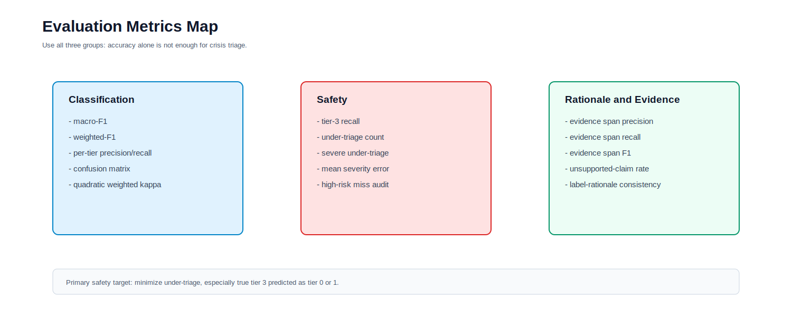

# Student Model Prediction Pipeline

## Purpose

This pipeline runs a trained small/student model on dev, test, or robustness inputs.

It is separate from:

- teacher auxiliary-label generation
- teacher-label judging
- student-model metric evaluation

Use this pipeline only after:

1. teacher labels have been generated and judged
2. student training data has been created
3. the student model has been fine-tuned

## Boundary Figure



## Inputs

The prediction pipeline uses:

- dev examples for checkpoint selection
- locked test examples for final reporting
- optional noisy or hard-negative views for robustness

Do not use raw teacher-generation files as final test truth.

## Stage 1. Prepare Prediction Inputs

Convert a CSV split into prediction JSONL:

```powershell
python src/student_predictions/prepare_prediction_input.py `
  --input-csv data/processed/cssrs_splits/test.csv `
  --output-jsonl data/student_predictions/test_inputs.jsonl `
  --id-column User `
  --text-column Post `
  --gold-column Label `
  --split-column split `
  --allowed-splits test `
  --source cssrs
```

If you have human-reviewed structured labels, include them:

```powershell
--reference-column reference_json
```

The output has one record per example:

```json
{
  "id": "example-id",
  "text": "input text",
  "split": "test",
  "source": "cssrs",
  "gold_label": "original coarse label",
  "reference": {
    "risk_tier": 2,
    "evidence_spans": ["exact phrase"]
  }
}
```

## Stage 2. Run Student Predictions

Serve the fine-tuned model with a local OpenAI-compatible server such as vLLM or SGLang.

Then run:

```powershell
$env:LOCAL_LLM_API_KEY="dummy"

python src/student_predictions/generate_student_predictions.py `
  --input-jsonl data/student_predictions/test_inputs.jsonl `
  --output-jsonl data/student_predictions/test_predictions.jsonl `
  --model "local-student-triage-model" `
  --base-url "http://localhost:8000/v1" `
  --api-key-env LOCAL_LLM_API_KEY
```

Each output record contains:

- original input fields
- raw student output
- parsed `prediction`
- parse error if JSON parsing failed

## Stage 3. Handoff To Evaluation

The prediction pipeline stops after writing:

```text
data/student_predictions/test_predictions.jsonl
```

Metric scoring is done separately in:

```text
src/evaluation/
docs/student_model_evaluation_pipeline.md
```

## Boundary Summary

This pipeline produces:

```text
student prediction JSONL
```

It does not produce:

```text
teacher labels
teacher judge scores
human audit queues
training labels
metric reports
final test claims
```
