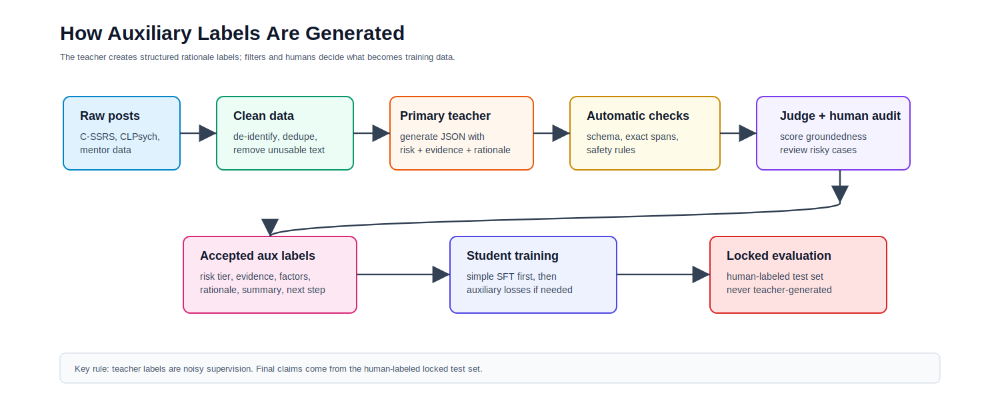
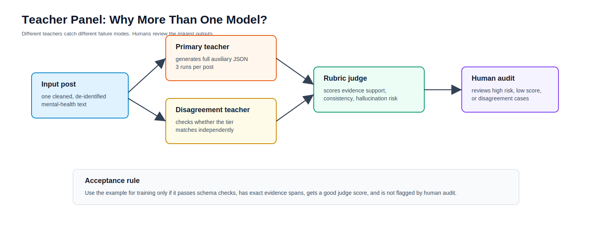
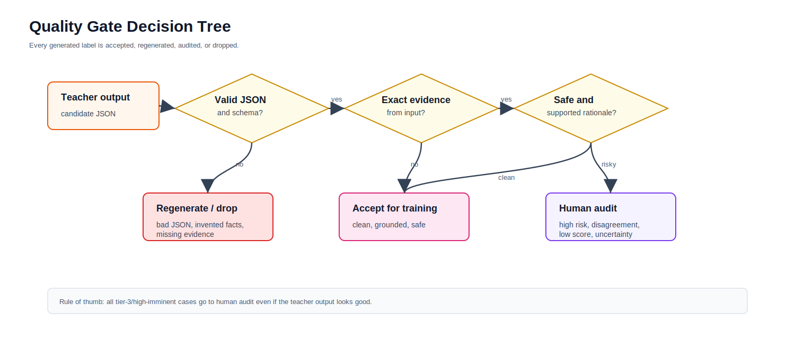

# Teacher Label Generation and Judging Pipeline

## Purpose

This pipeline creates structured auxiliary labels for training data.

It includes:

1. dataset preparation
2. train/dev/test split creation
3. teacher label generation
4. teacher-label judging
5. deterministic quality gates
6. human audit queue
7. accepted training-label export

It does **not** run or evaluate the trained student model.

Student prediction and student evaluation live in:

```text
src/student_predictions/
src/evaluation/
```

## Figure 1. Label Generation Boundary



## Stage 1. Prepare Data

For C-SSRS:

```powershell
python src/teacher_labeling/create_data_splits.py `
  --input datasets/cssrs/500_anonymized_Reddit_users_posts_labels.csv `
  --output-dir data/processed/cssrs_splits `
  --id-column User `
  --group-column User `
  --label-column Label `
  --text-column Post `
  --seed 42
```

For eRisk26 Task 2:

```powershell
powershell -ExecutionPolicy Bypass -File src/teacher_labeling/prepare_erisk26_task2.ps1 `
  -JsonDir datasets/eRisk26-datasets/task2-contextualized-depression/eRisk26-task2-trainingdata/final-eriskt2-dataset-with-ground-truth/all_combined `
  -Labels datasets/eRisk26-datasets/task2-contextualized-depression/eRisk26-task2-trainingdata/final-eriskt2-dataset-with-ground-truth/shuffled_ground_truth_labels.txt `
  -Output data/processed/erisk26_task2/erisk26_task2_subjects.csv `
  -MaxChars 12000
```

Then split eRisk:

```powershell
python src/teacher_labeling/create_data_splits.py `
  --input data/processed/erisk26_task2/erisk26_task2_subjects.csv `
  --output-dir data/processed/erisk26_task2/splits `
  --id-column subject_id `
  --group-column subject_id `
  --label-column gold_label `
  --text-column text `
  --seed 42
```

## Stage 2. Generate Teacher Auxiliary Labels

Generate only for train/dev splits:

```powershell
python src/teacher_labeling/generate_aux_labels.py `
  --input data/processed/cssrs_splits/all_with_splits.csv `
  --output data/synthetic_aux/raw_primary_runs.jsonl `
  --id-column User `
  --text-column Post `
  --gold-column Label `
  --split-column split `
  --allowed-splits train,dev `
  --model "google/gemini-2.5-pro" `
  --base-url "https://openrouter.ai/api/v1" `
  --api-key-env OPENROUTER_API_KEY `
  --runs 3
```

Output:

```text
data/synthetic_aux/raw_primary_runs.jsonl
```

## Stage 3. Judge Teacher Labels

Teacher judging is separate from generation code:

```powershell
python src/teacher_judging/judge_aux_labels.py `
  --input data/synthetic_aux/raw_primary_runs.jsonl `
  --output data/synthetic_aux/judged_candidates.jsonl `
  --model "anthropic/claude-sonnet-4" `
  --base-url "https://openrouter.ai/api/v1" `
  --api-key-env OPENROUTER_API_KEY
```

The judge checks:

- schema validity
- exact evidence spans
- label support
- rationale support
- hallucination risk
- whether human audit is required

## Figure 2. Teacher Review System



## Stage 4. Apply Quality Gates

```powershell
python src/teacher_judging/apply_quality_gates.py `
  --input data/synthetic_aux/judged_candidates.jsonl `
  --output-dir data/synthetic_aux/gated `
  --min-score 7 `
  --audit-score 8
```

Outputs:

```text
data/synthetic_aux/gated/
  accepted_auto.jsonl
  human_audit_queue.jsonl
  rejected.jsonl
  quality_gate_summary.json
```

## Figure 3. Quality Gate Logic



## Stage 5. Export Human Audit Sheet

```powershell
python src/teacher_judging/export_human_audit_sheet.py `
  --input data/synthetic_aux/gated/human_audit_queue.jsonl `
  --output data/synthetic_aux/gated/human_audit_sheet.csv
```

Human reviewers decide:

- accept
- correct
- reject
- uncertain / lead adjudication

All tier-3 and escalation-required examples should be human-reviewed before training.

## Stage 6. Build Student Training Data

After accepting/auditing examples:

```powershell
python src/teacher_labeling/build_student_sft_jsonl.py `
  --input data/synthetic_aux/judged_candidates.jsonl `
  --output data/synthetic_aux/student_sft_train.jsonl
```

This produces training data for the small student model.

The next step is no longer part of label generation. Move to:

```text
src/student_predictions/
```

## Boundary Summary

This pipeline produces:

```text
teacher-generated labels
judged labels
human audit queues
student training JSONL
```

It does not produce:

```text
student model predictions
student model metrics
final test performance claims
```
