# Structured CoT Training Data Generation Flowchart

Use this figure to explain how synthetic structured rationale data is created, filtered, and converted into student-model training examples.

```mermaid
flowchart LR
  A[Raw candidate posts<br/>C-SSRS / CLPsych / mentor data] --> B[Privacy and quality filter<br/>de-identify, dedupe, remove unusable text]
  B --> C{Data split}
  C -->|Train candidates| D[Teacher prompt v1<br/>rubric + schema + few-shot examples]
  C -->|Locked test set| T[Human-labeled gold test<br/>never teacher-generated]

  D --> E[Primary teacher generation<br/>3 runs per post, temp 0.0-0.3]
  E --> F[Structured CoT JSON<br/>risk tier, evidence spans, factors,<br/>rationale, plain summary, next step]

  F --> G{Automatic checks}
  G -->|Invalid JSON| R[Reject or regenerate]
  G -->|Missing exact evidence| R
  G -->|Diagnosis / advice violation| R
  G -->|Pass schema| H[Teacher evaluation layer]

  H --> I[Disagreement teacher<br/>flags tier mismatch]
  H --> J[Rubric judge<br/>evidence support, label consistency,<br/>hallucination score]
  H --> K[NLI/readability checks<br/>rationale entails label, summary is simple]

  I --> L{Quality gate}
  J --> L
  K --> L

  L -->|High risk / disagreement / low score| M[Human audit<br/>Lead + annotator review]
  L -->|Clean pass| N[Accepted synthetic CoT example]
  M -->|Correctable| N
  M -->|Unsafe or unsupported| R

  R --> O{Retry budget left?}
  O -->|Yes| D
  O -->|No| P[Drop from training set]

  N --> Q[Training record]
  Q --> S[Student model training<br/>label loss + auxiliary losses]
  T --> U[Final evaluation only<br/>macro-F1, high-risk recall,<br/>under-triage, evidence support]
  S --> U
```



## Example Training Record

Input post:

> I have a bottle of pills and I am going to take them tonight. My sister is in the next room but I do not want to tell her.

Accepted structured rationale output:

```json
{
  "risk_tier": 3,
  "confidence": 0.94,
  "evidence_spans": [
    "I have a bottle of pills",
    "I am going to take them tonight"
  ],
  "risk_factors": [
    "access to means",
    "time-bound intent"
  ],
  "protective_factors": [
    "sister is nearby"
  ],
  "clinical_rationale": "The post contains access to a lethal means and a time-bound plan. The nearby sister is a protective factor, but immediate escalation is still required.",
  "plain_language_summary": "This message suggests urgent danger because the person has pills and says they may take them tonight.",
  "recommended_next_step": "Emergency escalation",
  "escalation_required": true,
  "uncertainty_flags": []
}
```

Training use:

- Main loss: predict `risk_tier`.
- Auxiliary losses: predict `evidence_spans`, `risk_factors`, `protective_factors`, `clinical_rationale`, `plain_language_summary`, confidence/calibration, and `escalation_required`.
- Final claims are evaluated only on the human-labeled locked test set.
